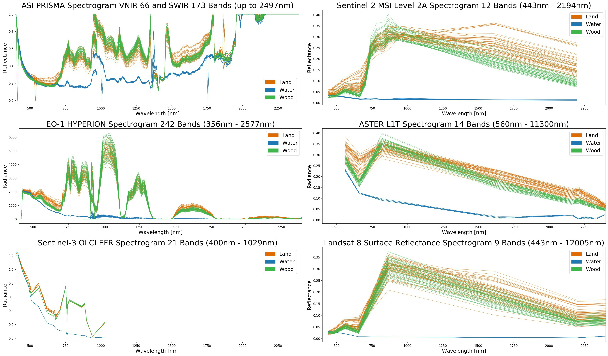
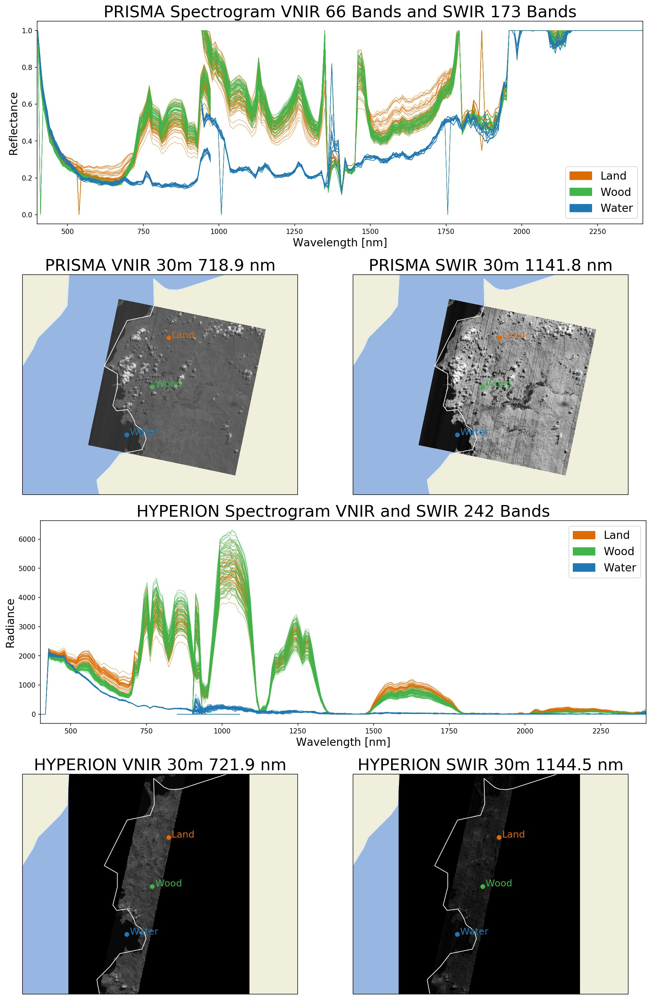
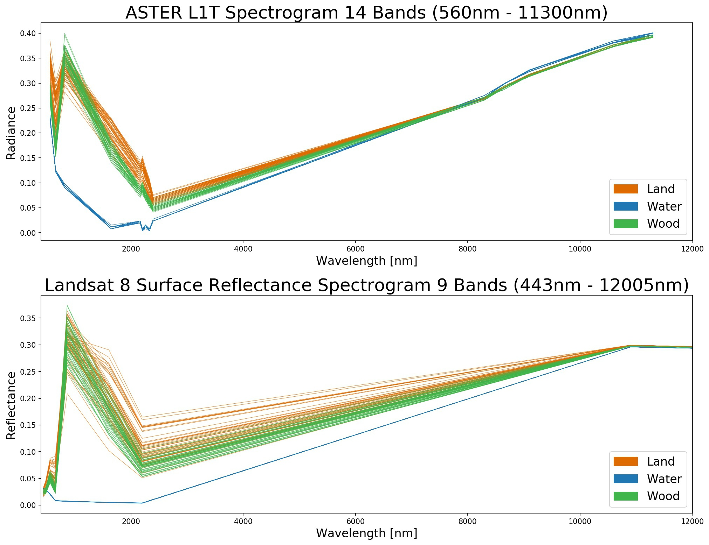

## Compare Spectral Bands of Hyperspectral and Multispectral Satellite Missions: ASI PRISMA L2C, EO-1 HYPERION 1T, Sentinel-3 OLCI EFR, Sentinel-2 MSI, ASTER L1T, USGS Landsat 8 SR

### Compare hyperspectral and multispectral products on West Sulawesy, Indonesia

### Compare hyperspectral products ASI PRISMA Normed Reflectance and EO-1 HYPERION Radiance on West Sulawesy, Indonesia

### Compare SWIR and Thermal bands of ASTER L1T Radiance and USGS Landsat 8 Surface Reflectance Tier 1 on West Sulawesy, Indonesia

## Source data

* Download PRS_L2C_STD_20200413023942_20200413023947_0001.zip from [PRISMA Mission Selection](http://prisma.asi.it/missionselect/)
* Download EO1H1150662006130110PY_1T.ZIP from [USGS EROS Archive - Earth Observing One (EO-1) - Hyperion](https://www.usgs.gov/centers/eros/science/usgs-eros-archive-earth-observing-one-eo-1-hyperion?qt-science_center_objects=4#qt-science_center_objects)
* Use provided Google Earth Engine scripts (GEE_\*.js) to produce all other datasets as GeoTiff files: [Google Earth Engine](https://code.earthengine.google.com/)
