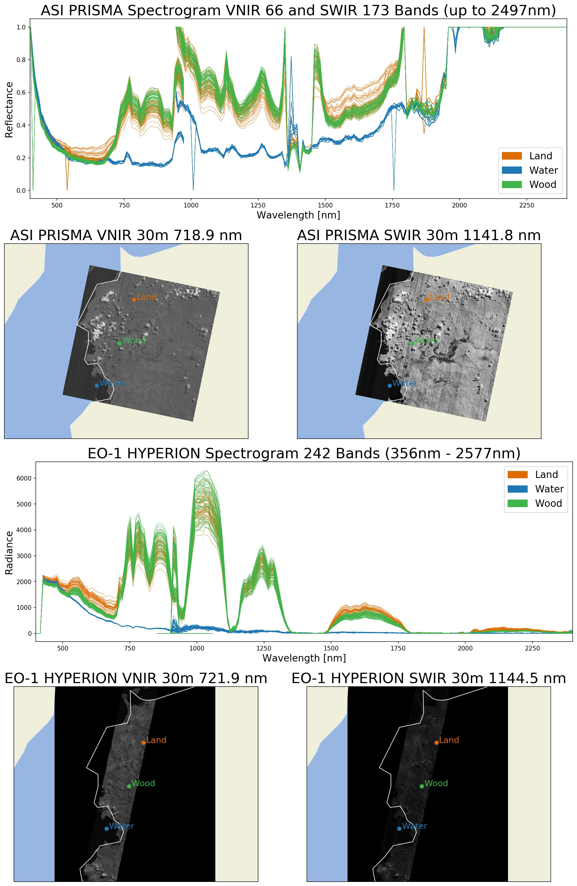

## Compare Spectral Bands of Hyperspectral and Multispectral Satellite Missions

### Compare hyperspectral and multispectral products on West Sulawesy, Indonesia

### Compare hyperspectral products ASI PRISMA Normed Reflectance and EO-1 HYPERION Radiance on West Sulawesy, Indonesia

### Compare SWIR and Thermal bands of ASTER L1T Radiance and USGS Landsat 8 Surface Reflectance Tier 1 on West Sulawesy, Indonesia

